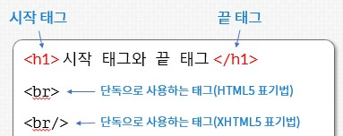
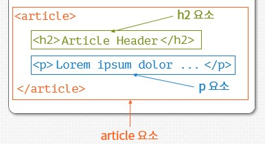
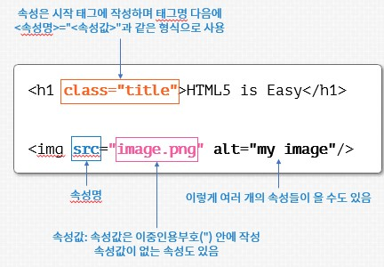

# HTML

<details>
<summary>목차</summary>

* [HTML5 기초](#HTML5-기초)
    * [HTML 기본 용어](#HTML-기본-용어)
    * [HTML5 페이지 구조](#HTML5-페이지-구조)
* [기본 태그](#기본-태그)
    * [글자 관련 태그](#글자-관련-태그)
    * [목록 관련 태그](#목록-관련-태그)
    * [표 관련 태그](#표-관련-태그)
    * [공간 분할 태그](#공간-분할-태그)
* [멀티미디어 관련 태그](#멀티미디어-관련-태그)
    * [이미지 태그](#이미지-태그)
    * [오디오 태그](#오디오-태그)
    * [비디오 태그](#비디오-태그)
* [입력 양식 태그](#입력-양식-태그)
    * [form 태그](#form-태그)
    * [input 태그](#input-태그)
    * [textarea, select, button 태그](#textarea,-select,-button-태그)
    * [fieldset과 legend 태그](#fieldset과-legend-태그)

</details>

## HTML5 기초

### HTML 기본 용어

**태그<sup>tag</sup>**

- HTML 페이지에서 객체를 만들 때 사용
- 일반적으로 시작 태그와 끝 태그가 쌍을 이룸
- 단독으로 사용하는 태그도 존재(끝 태그 X)
- 일부 태그는 태그 내부에 다른 태그가 포함될 수 있음
- 사용 가능한 표준 태그는 W3C 재단에서 결정

<br>



<br>

**요소<sup>element</sup>**
- 태그를 사용해 만들어진 객체

<br>



<br>

**속성<sup>attribute</sup>**
- 태그에 정보를 추가할 때 사용
- 태그마다 가질 수 있는 속성도 W3C 재단에서 표준으로 정의


<br>



<br>

**주석<sup>comment</sup>**
- HTML 코드를 설명하기 위해 작성
- <!-<!---->- 와 --> 사이에 작성

```html
<!-- 이것은 주석입니다. -->
```

<br>

### HTML5 페이지 구조

```html
<!DOCTYPE html>
<html lang="ko">
<head>
  <meta charset="UTF-8">
  <title>HTML5 Page</title>
</head>
<body>
  <h1>HTML5 Page</h1>
</body>
</html>
```
**!doctype**
- HTML의 버전을 명시
- HTML5는 !doctype 다음에 html이라고 작성
- [다른 버전 설명](#https://en.wikipedia.org/wiki/Document_type_declaration)

**html 태그**
- 모든 HTML 페이지의 루트root 요소
- 모든 HTML 태그는 html 태그 내부에 작성
- lang 속성에는 사용하는 언어를 설정

**head 태그**
- HTML 페이지의 여러 정보들을 제공
- head 태그에는 다음과 같은 태그만 포함 가능

|태그이름|설명|
|-|-|
|meta|웹 페이지에 추가 정보 전달|
|title|웹 페이지의 제목|
|script|웹 페이지에 스크립트 추가|
|link|웹 페이지에 다른 파일 추가|
|style|웹 페이지에 스타일시트 코드 추가|
|base|웹 페이지의 기본 경로 지정|
|||

<br>

**body 태그**
- 실제 사용자에게 보여지는 내용을 작성하는 부분

<br>

## 기본 태그

### 글자 관련 태그

### 목록 관련 태그

### 표 관련 태그

### 공간 분할 태그

## 멀티미디어 관련 태그

### 이미지 태그

### 오디오 태그

### 비디오 태그

## 입력 양식 태그

### form 태그

### input 태그

### textarea, select, button 태그

### fieldset과 legend 태그